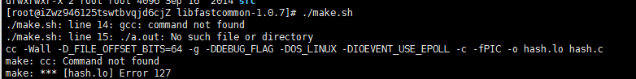
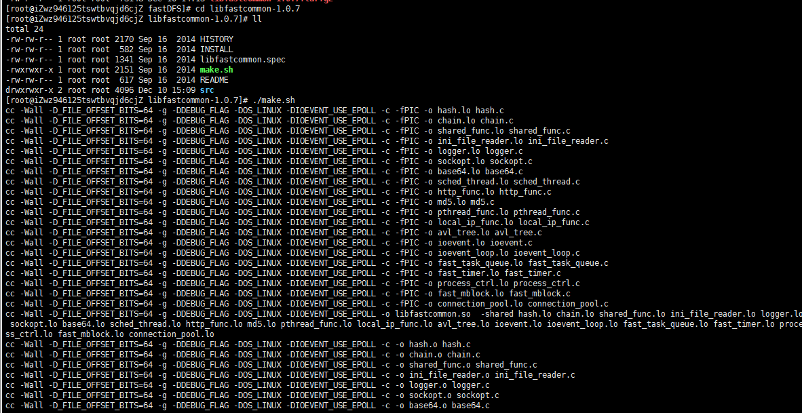
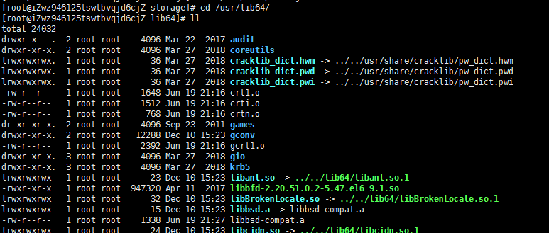
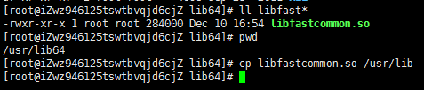
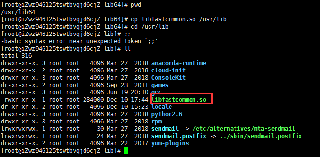
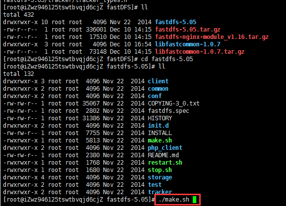
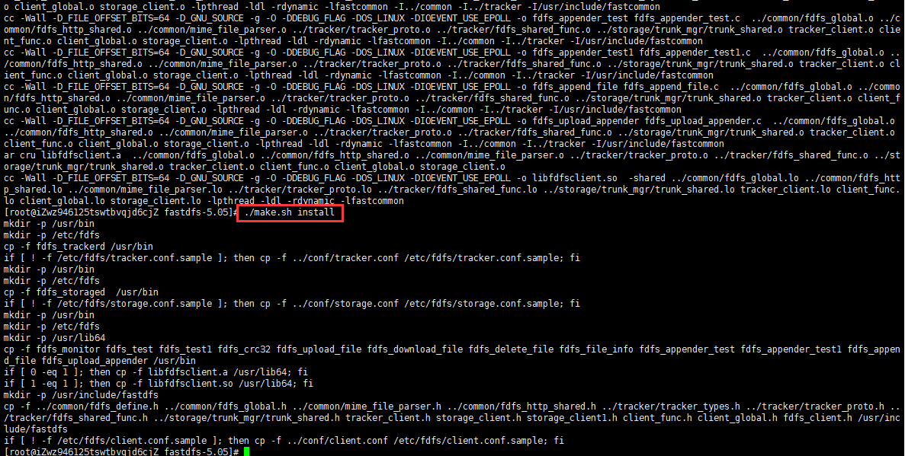
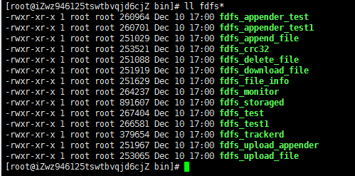
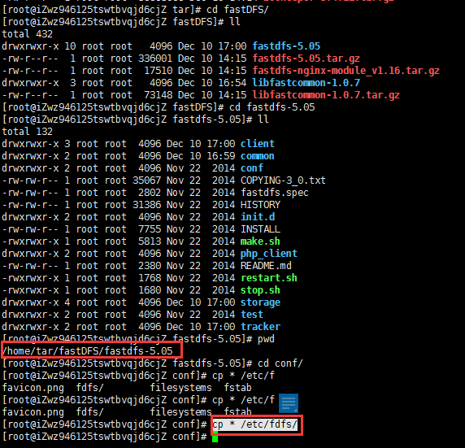
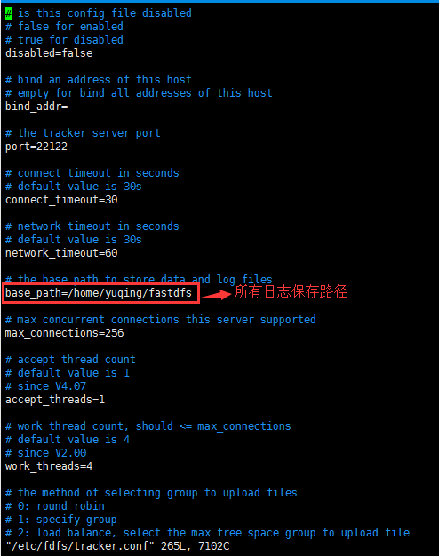

第一步：安装fastDFS依赖libevent工具包

```
yum -y install libevent
```

第二步：解压libfastcommon-1.0.7.tar.gz文件

```
tar -zvxf libfastcommon-1.0.7.tar.gz
```

进入解压后的目录

执行 ./make.sh



执行后发现由于用的是阿里云的云服务，没有安装g++ gcc

```
yum -y install gcc-c++
```

gcc and g++分别是GNU的c & c++编译器

先查看是否安装

执行命令：

gcc -v

g++ -v

后来在执行

```
./make.sh
```



成功后执行

./make.sh install

查看安装后的 cd /usr/lib64/



搜索 ll libfast* 文件并复制到32位盘下的lib文件夹下cp libfastcommon.so /usr/lib



 查看复制的该文件



 

第三步：安装Tracker服务

加压

tar -zvxf fastdfs-5.05.tar.gz

进入解压目录

./make.sh



./make.sh install



安装后在/usr/bin/目录下有以fdfs开头的文件都是编译出来的。

ll fdfs*



把/home/tar/fastDFS/fastdfs-5.05中的conf目录下的所有文件都复制到/etc/fdfs

cp * /etc/fdfs/



第四步：配置tracker服务

 修改/etc/fdfs/tracker.conf文件

 vim /etc/fdfs/tracker.conf




需要在根目录下创建fastdfs文件夹

```
 mkdir /fastdfs/tracker -p
 mkdir /fastdfs/storage -p
 mkdir /fastdfs/client -p
 mkdir /fastdfs/tmp -p
```

```
base_path=/fastdfs/tracker
```

 启动tracker服务命令

```
 /usr/bin/fdfs_trackerd  /etc/fdfs/tracker.conf
```


重启命令：

```
/usr/bin/fdfs_trackerd  /etc/fdfs/tracker.conf restart
```

第五步：安装storage服务

1、如果是在不同的服务器安装，第步的1~4需要重新配置

2、配置storage服务

修改/etc/fdfs/storage.conf

```
base_path=/fastdfs/storage/
```

 实际的图片存放路径

```
store_path0=/fastdfs/storage/
```

修改IP地址

**修改为：若为云服务，这里需要配置云服务公有ip**

```
tracker_server=88.88.88.88:22122
```

启动storage服务

```
/usr/bin/fdfs_storaged /etc/fdfs/storage.conf
/usr/bin/fdfs_storaged /etc/fdfs/storage.conf restart
```

 查看进程

ps -ef|grep fdfs

修改客户端配置文件/etc/fdfs/client.conf

vim client.conf

如果是云服务，这里需要配置成公网ip

```
tracker_server=88.88.88.88:22122
```

 第六步：测试

上传文件测试命令：

```
fdfs_test /etc/fdfs/client.conf upload  
```

 文件路径


/usr/bin/fdfs_test /etc/fdfs/client.conf upload imageLogin.jpg

执行该命令报错，检查在fastdfs是否创建client

没有创建后在执行该命令：mkdir client


 /usr/bin/fdfs_test /etc/fdfs/client.conf upload /home/imageLogin.jpg


走到这一步应该是没有开放阿里云的防火墙端口的，我们自己上去设置开放22122端口就OK

开放防火墙端口，测试


